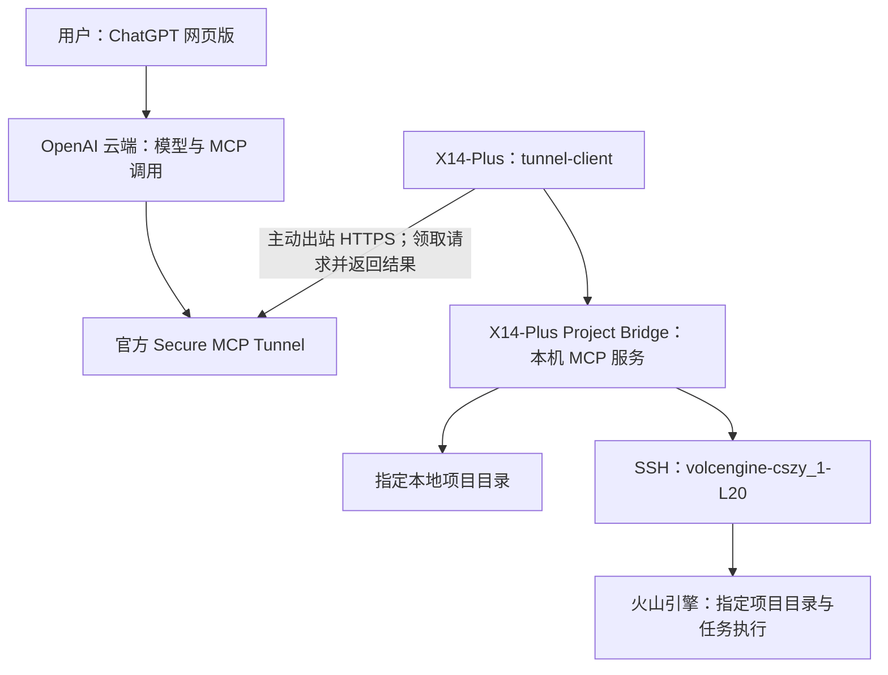

# X14-Plus Project Bridge

让 ChatGPT 网页版通过 MCP 直接操作 X14-Plus 上的指定项目，并通过 SSH 操作火山引擎项目。

**当前状态：本地与 SSH 工具已实现并实测；官方 Tunnel 已连接 ChatGPT 网页版，工具发现、状态查询、本地及 SSH 文件“写入—校验—恢复”、远程命令和代理联网均已通过真实网页调用。完全关闭 Codex 后的独立运行仍待最终验收。** 更新日期：2026-09-21。

先看 [项目全貌与运行维护](docs/06-项目全貌与运行维护.md)：当前架构、故障原因、Windows 任务启动方式、Codex/SSH 依赖、密钥轮换与验收边界。旧规划与本文不同处以该文为准。

## 已可使用

- 12 个 MCP 工具：项目摘要、目录、搜索、批量读取、写入/文本替换/删除、差异、恢复、Git 检查、后台任务及日志。
- 三个项目：本 Bridge、`D:\Knowin`、SSH 的 `volcengine-cszy`。
- 独立 Node.js + Python 运行时；不调用 Codex。
- `Configure-ChatGPT.cmd` 配置；`Start-Independent-Bridge.cmd` 和 `Start-Bridge.cmd` 通过 Windows 任务启动 Bridge/Tunnel，并检查和建立 SSH 代理转发。已有转发会被复用，缺失时自动尝试建立。请保持本地 Clash 运行；`Stop-Bridge.cmd` 停止，`Check-Bridge.cmd` 查看状态。
- 文件写入有哈希冲突检查和恢复记录；任意命令以服务账户权限执行，项目目录不是命令沙箱。

官方 tunnel-client 已安装并连接个人账号的私有 Tunnel。运行密钥只在本机配置窗口输入，使用 Windows DPAPI 加密保存。

## 核心结论

可以设计成不依赖本地或远程 Codex 运行的项目助手。ChatGPT 负责理解、规划和选择工具；X14-Plus 上的桥接服务实际读取文件、应用修改、运行命令和建立 SSH 连接。

本机必须运行软件：项目 MCP 服务，以及让云端可达该服务的连接客户端。优先验证官方 Secure MCP Tunnel；账号不可用时，再选择带认证的公网 HTTPS MCP 入口。只在网页里添加一个插件，不能自动使电脑文件可访问。

本地和 SSH 链路已实测；云端 Tunnel、目标账号、工具发现、本地与远程文件可恢复写入、远程命令及代理联网也已通过网页实测。关闭 Codex 后的独立运行仍需完成最后验收。官方支持依据见[来源与现场核验](docs/03-来源与现场核验.md)。

## 文档导航

优先阅读 [项目全貌与运行维护](docs/06-项目全貌与运行维护.md) 和 [交接记录与 Git 维护](docs/07-交接记录与Git维护.md)。最新网页任务 `web_remote_proxy_recheck_20260921_02` 已返回 exit 0、HTTP_STATUS=200，三段链路恢复；新版自有 SSH 转发冷启动及自动接管仍需单独验证。

1. [总体方案](docs/01-总体方案.md)：软件部署位置、官方接入、权限范围、SSH 与代理关系。
2. [工具与实施计划](docs/02-工具与实施计划.md)：工具接口、上下文效率、阶段交付与验收。
3. [来源与现场核验](docs/03-来源与现场核验.md)：官方链接、当前环境、未知项。

4. [网页版接入与日常使用](docs/04-网页版接入与日常使用.md)：现在该如何接入、启动和使用。
5. [实施与验收记录](docs/05-实施与验收记录.md)：已测结果与尚未验证的部分。

真实密钥、令牌和运行状态放在 `%LOCALAPPDATA%\X14-Plus-Project-Bridge`；SSH 私钥继续由系统 OpenSSH 使用，不进入项目文件。

开发检查：`npm test`。更新远端辅助程序：`npm run setup -- --remote`。远端实际 MCP 验收：`node scripts/verify-remote.mjs`。工具定义更改后需在 ChatGPT 刷新工具列表。
