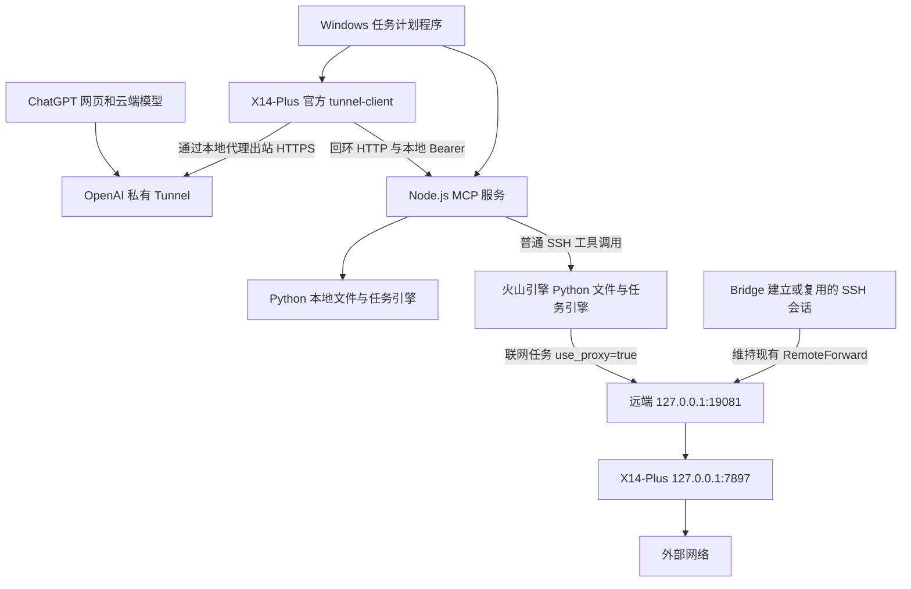

# X14-Plus Project Bridge：项目全貌与运行维护

更新：2026-09-21。本文是当前运行方式的主说明；01、02 为最初规划，若有不同以本文为准。

## 目的与当前结论

ChatGPT 网页中的模型通过官方私有 MCP Tunnel 调用 X14-Plus 上的工具，读取、搜索、编辑本地及火山引擎项目，并启动任务、读取结果。模型交互在网页中完成，文件和命令由本项目的 Node.js/Python 执行，不向 Codex 模型转发请求。

本地和 SSH 文件创建、回读哈希校验、恢复、远程命令、代理联网已经由用户在真实 ChatGPT 网页验收成功。改为 Windows 任务启动后，用户重启电脑且未启动 Codex，网页已能访问 SSH 项目，证明该次 Bridge/Tunnel 与文件访问独立运行成功；但代理联网连接被拒绝。本次继续补齐独立 SSH 转发。

用户现已授权独立启动入口同时检查和建立代理转发。Clash 本地代理由自己的服务运行，不依赖 Codex；此前缺少的是维持远程 19081 到本地 7897 的 SSH 会话。

## 三条连接路径

1. 网页调用路径：OpenAI → Tunnel 队列 → 本机 tunnel-client → `127.0.0.1:18741/mcp`。本机主动出站，不开放公网入站端口。
2. 远程文件路径：Bridge 自行调用系统 OpenSSH 和服务器 Python；不需要服务器访问 OpenAI。工具 SSH 使用 `ClearAllForwardings=yes`，避免重复占用代理端口。
3. 远程联网路径：远端任务 → `19081` → SSH RemoteForward → 本机 `7897` → 外网。独立任务检查本地代理、远程端口及 HTTPS；已有监听则复用，缺少监听且无自有 SSH 进程时建立连接。保留原 Host 配置，不抢占端口，不关闭其他 SSH。Clash 需自行保持运行。

## 为什么之前超时

已观察到：退出 Codex 后 Bridge/Tunnel 不在运行，旧 PID 失效，日志停在先前成功调用时间。因此连不涉及 SSH 的 `bridge_status` 也可能超时，不能把所有失败归因于远端代理。

之后启动日志明确出现：Windows PowerShell 无法加载 `Microsoft.PowerShell.Security`，在 `ConvertTo-SecureString` 处退出。已改成加载与当前 Windows PowerShell 匹配的系统模块，并隔离继承的模块搜索路径。旧启动器仅等待 700ms，已改成轮询健康状态。

原先根据父进程已退出推断“服务不会随 Codex 结束”，证据不足，现撤回该保证。Windows Job 生命周期是可能因素，但未取得 Job 对象诊断，不能写成已证明的唯一根因。新实现通过 Windows 任务服务启动，避免依赖 Codex 启动宿主。

诊断时任务内与调用会话的配置/健康读取曾不一致；当前启动结果由运行任务自身使用本地认证与 MCP SDK 验证后发布，状态包含时间戳。具体环境差异尚未完全定位，不把外层检查失败误当作任务内 MCP 一定不可用。

## 日常启动与停止

1. 打开本地网络代理，确保 `127.0.0.1:7897` 可用。
2. 不必先启动 Codex。启动器使用 `volcengine-cszy_1-L20` 的现有 `RemoteForward 127.0.0.1:19081 127.0.0.1:7897`。SSH 密钥认证须可用。
3. 双击 `Start-Independent-Bridge.cmd` 或 `Start-Bridge.cmd`，两者现在指向同一个 Windows 任务启动器。
4. 正常显示 `Local bridge healthy: True`、`Tunnel readiness HTTP: 200`、`Authenticated HTTP MCP verification: PASS`。窗口可以关闭。
5. 在网页选中 X14-Plus Project Bridge 后执行任务。不需要重建插件、隧道或密钥。

任务名：`X14-Plus-Project-Bridge-Runtime`。当前用户交互登录、普通权限、无登录触发器、不保存 Windows 密码。重复启动不重复创建运行任务。工作进程启动时及每轮约 60 秒检查代理（另加探测耗时），必要时尝试建立 SSH；不会自动重启 Bridge/Tunnel。开机自启动与注销后运行不在本次保证范围。

`SSH forwarding owner: external` 表示复用已有连接，可能由 Codex 维持；其断开后下一轮检查尝试接管，会有短暂中断。`bridge` 表示本项目登记的 SSH 连接。HTTPS 失败不等于端口缺失：如果已有监听但联网失败，只报告异常，不杀死未知连接。`Remote proxy HTTPS: True` 代表最近一次实际请求 python.org 返回 200；状态包含检查时间，不保证所有网站或持续连接均正常。代理异常不会关闭可用的 Bridge/Tunnel。

`Check-Bridge.cmd` 查看状态；`Stop-Bridge.cmd` 停止本项目登记的连接进程，任务宿主随后退出。不会终止 Codex 或其他程序的 SSH 连接。电脑休眠、注销、断网仍可中断连接。

## 工具与上下文策略

| 工具 | 用途 |
| --- | --- |
| bridge_status / list_projects | 识别机器与项目能力，不等于探测远端 |
| project_context | 有界目录、说明文档、AGENTS 和 Git 状态 |
| list_files / search_project | 先缩小目录，再按需搜索，分页返回 |
| read_files | 批量读取相关行，返回 SHA256 |
| apply_changes | 新建、精确替换、写入、删除，校验旧哈希并记录差异 |
| restore_change | 检查修改后哈希，恢复指定修改 |
| git_inspect | Git 状态、差异和日志 |
| start_job / get_job / cancel_job | 后台命令、增量输出和取消 |

优先获取项目上下文、搜索目标、读取相关行，再基于哈希编辑；不把整个目录一次性塞给模型。使用唯一 operation_id，同一次不确定结果的重试复用原 ID，不同操作必须更换 ID。首次调用在执行前被审批拦截后的成功重试，不等于验证了服务端已执行操作的去重分支；后者有本地测试覆盖。

项目：`bridge` → `D:\Program Files\X14-Plus-Project-Bridge`；`knowin` → `D:\Knowin`；`volcengine-cszy` → `/Knowin/sim/chensuzeyu`。远端根目录不是 Git 仓库，Git 工作应选择其中实际仓库子目录。

## 文件与凭据布局

源码、启动器、文档：`D:\Program Files\X14-Plus-Project-Bridge`。

当前用户配置、DPAPI 加密密钥、运行记录、日志：`%LOCALAPPDATA%\X14-Plus-Project-Bridge`。远端引擎与记录位于 `/Knowin/sim/chensuzeyu/.x14-plus-project-bridge`。SSH 私钥继续由系统 OpenSSH 使用。项目根目录 `runtime-status.json` 只含运行状态，不含密钥。

API key 轮换：在 Platform 创建同权限新密钥，双击 `Replace-API-Key.cmd`，保存后测试网页调用，再撤销旧密钥。不必更换 Tunnel ID、插件或项目配置。真实轮换仍未验收。API key 不发到聊天、不写入源码；桥接器不调用模型推理 API，不承诺隧道收费政策。

## 权限与限制

官方私有隧道限定组织/工作区，本机 HTTP 再加随机 Bearer；服务只监听回环。网页选择无额外应用认证仅适用于此私人隧道，不适用于公开部署。

文件 API 限定登记根目录、拒绝常见凭据路径和链接越界，修改前检查 SHA256，并保留恢复记录。多文件操作不是完整事务。任意命令以服务账号权限执行，项目工作目录不是沙箱，仍能访问账号有权限的其他位置。读取到的源码会进入云端模型上下文。

本版没有桌面键鼠/截图、语义索引、自动日志清理、多用户 OAuth，也不会自动继承 Codex 历史、内部工具或配额。单文件最多 2MiB，任务输出最多 8MiB，任务可设置最长 24 小时超时。持久任务记录不代表服务失效或系统重启后任务能自动恢复。

## 验证与后续

最新用户网页验收：`web_remote_proxy_recheck_20260921_02`，completed、exit 0，输出 `PROXY_RECHECK_OK` 和 `HTTP_STATUS=200`。当前三段链路恢复正常；该日志未单独证明新版无 Codex 冷启动或自有转发接管，见 [完整交接记录](07-交接记录与Git维护.md)。

已通过：8 项本地自动测试；网页本地与 SSH 文件闭环；远程输出 `REMOTE_EXEC_OK` 和代理 HTTP 200；新 Windows 任务启动器的本机 HTTP MCP 工具发现、状态与 README 读取。

本次已验证：新版 Windows 任务启动成功；认证 MCP 检查通过；复用现有 SSH 转发，远程 HTTPS 实际返回 200，状态 owner=external。没有为了测试而中断 Codex SSH。

待验证：新版在重启且不启动 Codex 时建立自有转发、已有转发消失后的自动接管、真实密钥轮换。下一次重启后打开 Clash，双击 Start-Independent-Bridge.cmd，确认 Remote proxy HTTPS=True、owner=bridge，再从网页执行 use_proxy=true 联网任务。

## 官方依据

[OpenAI Secure MCP Tunnel](https://developers.openai.com/api/docs/guides/secure-mcp-tunnels)：出站 HTTPS 连接、持续运行的 tunnel-client 与私有 MCP 可达性是官方要求；官方协议本身不要求 Codex 运行。
